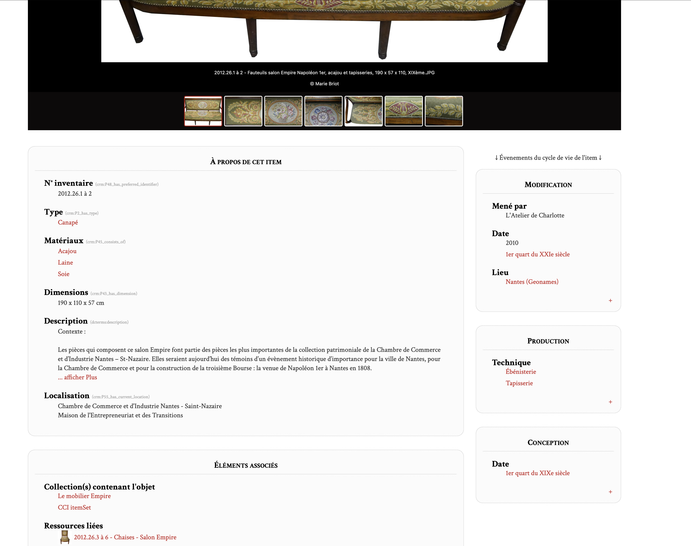

# Center Row event oriented

This is a fork of the [Center Row theme](https://github.com/omeka-s-themes/centerrow) v1.8.3
Compatible with omeka-S v4.x.x

It is related to the feature asked in the omeka forum: https://forum.omeka.org/t/feature-request-show-some-linked-items-in-public-item-page/15914

## Content
This fork modify the item page.

### Goal
It shows other items of certain classes ("events") on the page of tangible items.

It is usefull in event oriented ontology like CIDOC-CRM. 
Indeed, in that case the lifecycle of a tangible item is stored in "events" item.
e.g. MonaLisa painting is a tangible item (with material, dimension, etc.), the production of MonaLisa is another item (event: with time-span, technique, involved people, etc).

### Render
Displays on the same public page of a tangible item, the physical metadata (material, dimensions, etc.) 
and some related items data (production metadata, location metadata).

Live example: https://epotec.univ-nantes.fr/s/ccinsn/item/300

### Other improvements
- picture copyright is displayed in lightGallery below the picture
- a "read more" functionality hide long text block, so to be more pleasant in the page
- css changes

## Copyright
Center Row is Copyright © 2016-present Corporation for Digital Scholarship, Vienna, Virginia, USA http://digitalscholar.org  
Center Row is Copyright © 2023-present École Centrale de Nantes, Nantes, France, https://ec-nantes.fr

The Corporation for Digital Scholarship distributes the Omeka source code
under the GNU General Public License, version 3 (GPLv3). The full text
of this license is given in the license file.

École Centrale de Nantes distributes this fork under the same licence: GNU General Public License, version 3 (GPLv3). 

The Omeka name is a registered trademark of the Corporation for Digital Scholarship.

Third-party copyright in this distribution is noted where applicable.

All rights not expressly granted are reserved.
